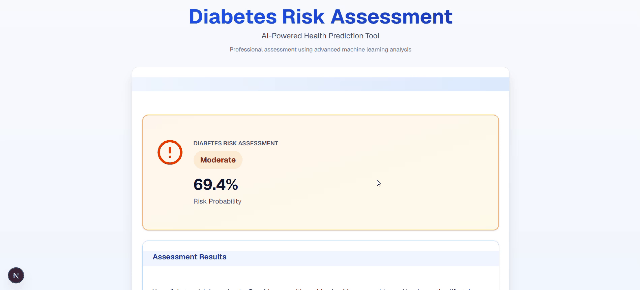

# Diabetes Risk Assessment

A web app that estimates a person's risk of developing type 2 diabetes from lifestyle, physical, lab, and medical-history inputs. A neural network runs **entirely in the browser** with TensorFlow.js — no data ever leaves the user's device.

## Demo



## What it does

The user is guided through a 5-step wizard that collects 22 fields about their health and lifestyle. The app then preprocesses those inputs (scaling, label encoding, one-hot encoding) into a 30-dimensional feature vector, runs them through a trained dense neural network, and returns a diabetes risk probability — categorized as **Low**, **Moderate**, or **High** — along with a short description and next-step recommendations.

The wizard collects:

| Section | Fields |
|---|---|
| **Personal Information** | Age, Gender, Ethnicity, Education, Income, Employment |
| **Lifestyle** | Alcohol intake, Physical activity, Diet score, Sleep, Screen time, Smoking status |
| **Physical Measurements** | BMI, Waist-to-hip ratio, Systolic / Diastolic BP, Heart rate |
| **Lab Results** | HDL, LDL, Triglycerides |
| **Medical History** | Family history of diabetes, Hypertension history, Cardiovascular history |

## Features

- Multi-step wizard with progress indicator and inline guidance
- Interactive sliders with safe / risk range hints
- Client-side inference — works offline after the first load
- IndexedDB model caching to skip the network on repeat visits
- Categorized risk output with a plain-language explanation
- Admin route (`/admin`) for inspecting scaler parameters and running quick model tests

## Tech Stack

- **Next.js 16** (App Router, Turbopack) + **React 19** + **TypeScript**
- **Tailwind CSS 4** + **Radix UI** primitives (shadcn-style components)
- **TensorFlow.js** for in-browser model inference
- A **Keras Sequential** model (30 inputs → Dense 256 → 128 → 64 → 1 sigmoid) exported to TF.js

## How the prediction works

```
form inputs ──► preprocessing (scale + encode) ──► [1, 30] tensor
                                                       │
                                                       ▼
                                       TF.js model (browser)
                                                       │
                                                       ▼
                                       risk probability (0.0 – 1.0)
                                                       │
                                                       ▼
                                       Low (<40%) · Moderate (40–70%) · High (>70%)
```

Numerical features are z-score scaled with mean / std values from the training set. Categorical features (gender, ethnicity, smoking, employment) are one-hot encoded with `drop_first=True`; education and income are label-encoded as ordinals.


## Project Structure

```
app/                          Next.js routes (/ and /admin)
components/
  diabetes-predictor-wizard   Top-level wizard state machine
  steps/                      Per-step form components
  admin/                      Admin tools (scaler settings, model tester)
  ui/                         Reusable UI primitives
lib/
  preprocessing.ts            Form data → 30-feature vector
  model-utils.ts              TF.js model loading + inference + fallback
  validation.ts               Field-level range validation
public/models/best_diabetes_model/
  model.json                  Keras → TF.js model topology
  model.weights.bin           Trained weights (~200 KB)
```

## Disclaimer

This tool is for **educational and informational purposes only**. It is not a medical device, has not been clinically validated, and must not be used to diagnose, treat, or make decisions about any medical condition. Always consult a qualified healthcare professional for medical advice.

